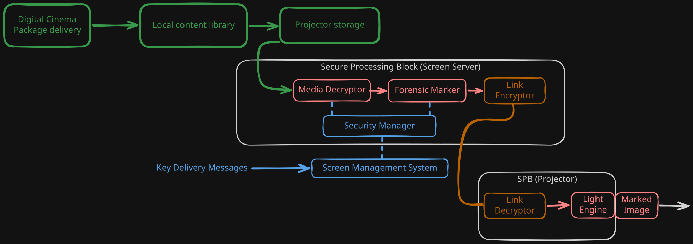
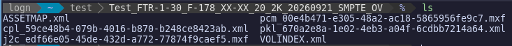
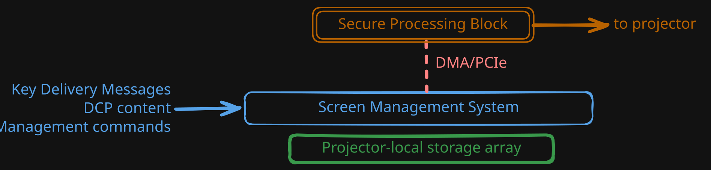
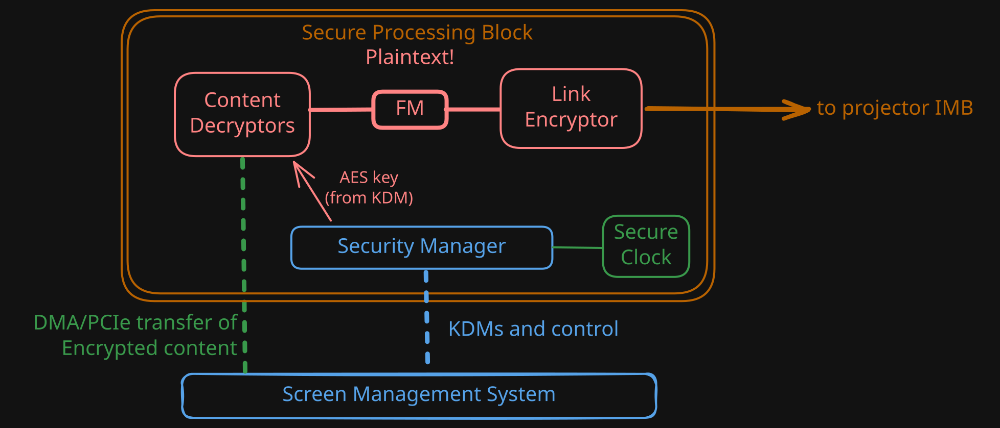
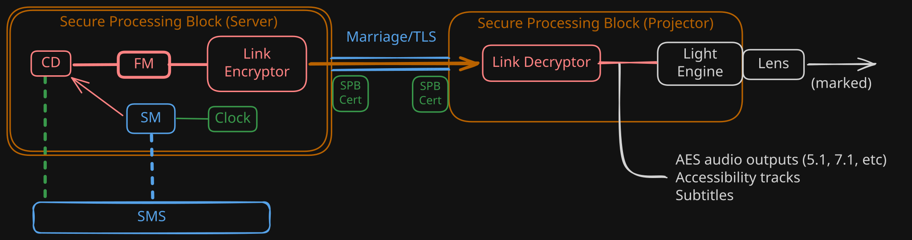

+++
title = "Inside Digital Cinema Security Architecture"
date = "2026-09-23"
authors = ["Logan Devine"]

[taxonomies]
tags = ["cinema", "deep dives", "computer architecture"]
+++

_Avengers: Doomsday_ is reported to have a production budget of over $400 million. When you watch a movie at home, the task is quite simple: decrypt the content and play it on a screen. In digital cinema, the stakes are much higher: full-resolution theatrical masters are delivered to theaters days in advance, where they sit on storage, are transferred to projectors, and eventually played back before the films are generally available.

That creates an unusual security problem. In the music industry, record stores are common sources of leaks, when employees receive early access to shipments of a particular album. So, how do studios provide exhibitors with the ability to play back a movie, while preventing unauthorized copying?

Simply encrypting the film at rest doesn't suffice. The security model in question treats the equipment in the projection booth and the cinema operators themselves as untrusted. The security therefore protects the content from when it is stored at rest, all the way to when it is physically projected on a screen.

# The Digital Cinema Initiatives

In 2002, a group of [seven major motion picture studios][DCI-founders] came together to form a coalition known as Digital Cinema Initiatives, LLC. The primary purpose of this coalition was to produce a series of open standards that would ensure interoperability amongst studios and various digital cinema vendors. Their primary work, the [Digital Cinema System Specification][DCSS], more commonly referred to as the "DCI specification," covers a series of basic technical and quality requirements to ensure consistency across tens of thousands of cinemas worldwide.

[DCI-founders]: https://en.wikipedia.org/wiki/Digital_Cinema_Initiatives#:~:text=The%20organization%20was%20formed%20in%20March%202002
[DCSS]: https://documents.dcimovies.com/DCSS/draft/latest/Digital-Cinema-System-Specification.pdf

Out of this very long standard, we are interested in one thing in particular: how does the DCI spec keep content secure, when it eventually _must_ become plaintext to be turned into light?

# The Journey to Playback

The following diagram is just a glimpse at the overall roles in the DCI security process.

As you can see, this process is far different than the traditional DRM one might see with streaming. So, let's follow the valuable plaintext master through all of the steps in this diagram, up to when it is finally projected to an audience.

# Receiving the Content

Unlike the old days where cinemas received trucks and had to unload reels of film, digital cinemas receive films in the form of DCPs, or Digital Cinema Packages. These large folders often are delivered by whatever mechanism the distributor desires: many come over satellite, via the standard Internet, and sometimes via a specialized hard drive.

DCPs are not simple video containers like MPEG4, they are in fact directories (folders) containing primarily XML files and MXF containers. These MXF containers contain Linear PCM audio and JPEG2000 frames for audio.

This is the structure of a simple DCP. Inside, there is a volume index (VOLINDEX.xml), an asset map (ASSETMAP.xml), a Packing List (pkl\_...) and a Composition Playlist (cpl\_...). These 4 XML files inevitibly reference the 2 MXF "reels" containing both the video and audio "essences" of the DCP.



Yeah, they're [actually that bad](https://www.isdcf.com/registry/illustratedguide/).

The file name alone contains almost all of the human facing metadata, like audio language and aspect ratio. It's horrible.



# Safety at Rest

The first layer of protection defends against the most obvious attack: extracting the content of the DCP directly once it's received. This is solved through DCP encryption, which encrypts the contents of the video containers using the symmetric cipher AES-128-CBC.

AES-128 was chosen here by DCI because of the sheer amount of data that a DCP might contain (many larger feature films are upwards of 300-400GB!). As we will soon learn, this data is decrypted realtime by a server attached to the projector.

## But where are the keys?

A naive approach might be to give the cinema access to the keys when they are first allowed to screen the film. This provides security against early unauthorized access, but once the cinema has the keys, they can then extract the content. Historically, when film reels were in use, if an exhibitor refused to return their content the studio would need to sue the theater to get their prints back. One of the things studios desire to protect against is the unauthorized playback of their content to an audience too early (before a release) or too late (after the exhibitor's booking has expired).

To provide this guarantee, these AES keys are exchanged through the use of Key Delivery Messages (KDMs) delivered out-of-band. These KDMs are delivered to the cinema a few days in advance of the screening, after the distributor has confirmed the booking, often delivered via a simple email.

Inside these emails, you'll find a `.kdm.xml` file, which contains information about a specific clip that it authorizes, a "ValidAfter" and "ValidBefore" timestamp, and finally an RSA-2048 encrypted payload. But for who, you might ask?

## Screen Servers

Every projector has an adjacent server, which may be integrated directly into a card in the projector's head-end (as with newer Integrated Media Block modules) or a discrete rack-mounted unit. Many vendors make these systems (e.g. Dolby, Christie, GDC) and they are often integrated into a full suite of projection management hardware and software.

These servers, known as **screen servers**, contain all of the necessary functions for content transfer, playback, scheduling, management, and GPIO. They receive content, commands, and those very Key Delivery Messages for processing.

## Securing the KDM

The key delivery message itself contains an RSA-2048 encrypted payload, which is encrypted directly to the public key of the screen server in question. Inside this RSA message is the actual symmetric key used to decrypt the AES blocks.

This allows distributors to ensure that their film is only played back on an authorized screen, by certified hardware. However, it is important that this hardware be field-servicable (as it often includes a large disc array), while still ensuring that the physical chips storing the screen server's RSA private key are kept safe from tampering.

That security is the role of the Secure Processing Block. These blocks are typically PCI cards, or otherwise tightly integrated components including what DCI calls "Secure Silicon." The specification mandates components be held up to an adjusted version of the [FIPS 140-2](https://nvlpubs.nist.gov/nistpubs/FIPS/NIST.FIPS.140-2.pdf) standard's third compliance level, which mandates both tamper evident designs and active efforts to prevent the extraction of contained cryptographic key material and certificates.

For most secure silicon designs, this involves using tamper-resistent ICs, and often burying a web of sensitive traces into a solid, opaque block. If any of these security measures are broken, the cryptographic modules embedded within the silicon will erase themselves, effectively bricking themselves. These designs are often also dependent on battery power: projectionists regularly check battery voltages to prevent the server from losing its private key and bricking itself.

At this point, the movie is encrypted at rest, and the keys that can decrypt it are only able to be read by the specific projector. But what happens inside of the screen server's SPB at playback time?

# Playback and Decryption

Inside of this secure silicon, you'll find the Security Manager (SM), which manages the actual cryptographic key material of the screen server. It provides the Content Decryptors with the AES keys required to decrypt the actual content, and also has a secure clock to authorize the KDM's validity.

To solve the problem of a cinema holding a film longer than intended, this secure module will trust its own clock from the factory, which cannot be adjusted by the exhibitor any more than 7 minutes per year. It is expected to stay as close to proper UTC as possible, and it is how the Security Manager decides if a KDM can be decrypted.

If the KDM is no longer or not yet valid based on its provided timestamp, the SM will refuse to play back the show entirely.

At this point, the individual "essence" (audio, video, subtitles) has been decrypted, with the entirety of it remaining within the top physical security of the Secure Processing Block. Now that we've solved the problems of validity times, we must worry about where the ciphertext goes next. In this case, that's directly into the **forensic marker** (FM).

# Forensic Marking

The DCI standard acknowledges that it is impossible to fully secure the content once it is in the final stages of the projector or once it's on the screen. To solve this, DCI compliant media servers are required to inject a forensic mark into most encrypted content they play back, identifying the current time and its serial number (and hence the location and auditorium).

The specifics of this architecture are proprietary to the individual IMB manufacturer, but they are invisible marks encoding this very information typically into both audio and video. A very common solution is Thomson (Technicolor)'s NexGuard forensic mark, but these specific solutions are kept proprietary to prevent reverse engineering and potential removal.

Once the content has been marked, still within the SPB, it now needs to leave this secure region to travel to the projector's head-end.

# Link Encryption

In older discrete media server installations, which are still common in many cinemas worldwide, the data must travel from a separate rack-mounted Screen Server into the projector before it can be projected.



In newer installations, all of this functionality is integrated into one card often embedded directly into the projector. In that case, it is all integrated into one Secure Processing Block, with no link encryptor and no marriage mechanism. For those scenarios, the standard still requires the same physical access controls.



To prevent interception of this link, the two SPBs (screen server and projector) must be "married." This prevents interception along a physical connection between these two different components. If this connection is broken or serviced for any reason, the two components will endure a very difficult divorce.

To marry these two components, an authorized technician of the manufacturer is required, who has the ability to inspect the connection and bless the marriage. This link is also established using digital certificates issued to authorize DCI-compliant devices by their manufacturer.

The SPB in the projector, however, is not held to the same security standards as the screen server, as it's often required to be far more servicable.

This marriage will be broken if the projector SPB detects any form of tampering, or if manually requested by a technician. This marriage also has a third state, for "maintenance," which allows projector manufacturers to provide a maintenance access door into the important signal chain components (such as the light engine) while preventing someone from, for example, soldering directly onto the board to receive signals. It is still required that the private key for the certificate associated with the projector is kept on the same Secure Silicon, to prevent that from being reused to MITM it.

So, at this point, the data has passed over a trusted, inspected (and authorized with PKI) link into a secured region of the projector. If any access doors into this portion of the projector are open (the maintenance state), the projector is required to inhibit playback.

Here, the link to the projector is decrypted, and the plaintext (but marked) video essence is passed directly to the projector's internal components.

# Audio

The DCI standard does not treat audio as something that must be secured up to the speaker. If they did, you would need specialized, certified "d-cinema speakers" with the ability to decrypt directly to a secure region. So, after the Link Decryptor decrypts the contents in the head of the projector, there are typically direct plain outputs for audio, subtitles, etc.

The philosophy here assumes that audio is far less valuable in the creation of a bootleg copy of a film, which would be true. The protection all the way up to the LD still stands.

# Logging

This implements the "control lightly" portion of the standard's security model, but as with all industries the audit requirements are far stronger. The specification requires the Security Manager inside the screen server to also preserve at least a year of logs for every clip's start and end, security actions (like the projector's service door opening and closing), etc. in a non-volatile ring buffer.

These logs are often published over the network (for local tools' consumption) and also stored internally, with cryptographic signatures tying them back to the specific SM which produced them.

# Recap

* A DCP is delivered to the cinema containing encrypted contents, sometimes weeks before the screening
* A KDM (Key Delivery Message) is sent to the cinema a few days before the showings are scheduled to start, containing contents encrypted to a specific screen server.
* Physically secure hardware modules within the screen server's secure silicon (capable of erasing themselves at a moment's notice) hold the private key required to decrypt that KDM and issue the secrets required to decrypt the actual AES blocks of the film.
* This content is overlayed with a forensic mark, preventing camcorder usage or extraction later in the process.
* These marked feeds are encrypted over a physically trusted and certificate authorized TLS link to another secured segment of the projector itself.
* If any access hatches are opened on the projector, content playback is stopped to prevent physically accessing the data as it is prepared to become light
* A comprehensive audit log is preserved of all security actions, including what is played back and when

All in all, this security model shows just a glimpse of the amount of work the major studios are putting in to help preserve their valuable master copies and pre-release assets. This architecture in specific shows how just a small set of cryptographic primitives (RSA-2048, AES-128-CBC, TLS, PKI models, secure silicon, and even plain old physical inspection) can come together to form an incredibly secure system.
